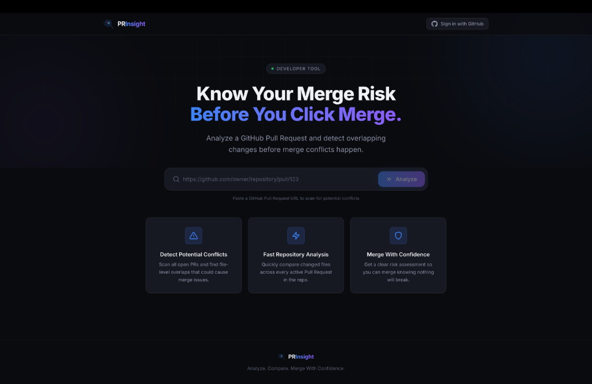

# PRInsight

> **Know Your Merge Risk Before You Click Merge.**

PRInsight is an open-source developer tool that analyzes a GitHub Pull Request and detects potential conflicts with other active Pull Requests in the same repository **before** they become merge conflicts.

Instead of discovering conflicts during the merge process, PRInsight helps developers identify overlapping changes early, making collaboration faster and safer.

🌐 **Live Demo:** https://pr-insight-phi.vercel.app/

---

## ✨ Features

- 🔍 Analyze any public GitHub Pull Request using its URL
- ⚠️ Detect overlapping Pull Requests in the same repository
- 📂 Identify conflicting files between Pull Requests
- 🔬 Line-level conflict detection
- 📊 Automatic conflict risk classification (High / Medium / Low)
- 📋 Detailed conflict report with overlapping files
- 🔐 GitHub OAuth for user authentication
- ⚡ In-memory caching for faster repeated analyses
- 🚦 Rate limiting for API protection
- 🔄 Automatic GitHub API retry and rate-limit handling
- 🚀 FastAPI backend with GitHub REST API integration
- 🎨 Modern React + Tailwind CSS interface
- 📚 Interactive API documentation with Swagger
- 🧪 Comprehensive automated testing

---

# 🚀 Live Workflow

```text
GitHub Pull Request URL
            │
            ▼
React Frontend
            │
            ▼
FastAPI Backend
            │
            ▼
GitHub REST API
            │
            ▼
Conflict Detection Engine
            │
            ▼
Conflict Report
            │
            ▼
React Results Dashboard
```

---

# 📖 Why PRInsight?

GitHub generally reports merge conflicts only during or close to merging.

PRInsight helps developers detect **potential merge conflicts earlier** by comparing the target Pull Request with every active Pull Request in the repository.

This enables developers to:

- Reduce merge surprises
- Coordinate overlapping work earlier
- Identify busy parts of the codebase
- Improve collaboration

---

# 📸 Screenshots

> Screenshots will be updated as the project evolves.


- Analysis Progress
- Conflict Report
- No Conflicts Screen

---

# 🛠 Tech Stack

## Frontend

- React
- Vite
- Tailwind CSS

## Backend

- Python
- FastAPI
- HTTPX
- Pydantic

## APIs

- GitHub REST API

## Development Tools

- Git
- GitHub
- VS Code
- Antigravity IDE

---

# 📂 Project Structure

```text
PRInsight/

├── frontend/
│   ├── public/
│   └── src/
│       ├── components/
│       ├── hooks/
│       ├── pages/
│       ├── services/
│       ├── utils/
│       └── mock/
│
├── backend/
│   ├── app/
│   │   ├── api/
│   │   ├── cache/
│   │   ├── clients/
│   │   ├── core/
│   │   ├── exceptions/
│   │   ├── schemas/
│   │   ├── services/
│   │   ├── utils/
│   │   └── main.py
│   ├── tests/
│   ├── requirements.txt
│   ├── pyproject.toml
│   ├── .env.example
│   └── .python-version
│
├── vercel.json
└── README.md
```

---

# 🚀 Getting Started

## Clone Repository

```bash
git clone https://github.com/Mudaliyar-007/PRInsight.git

cd PRInsight
```

---

## Frontend

```bash
cd frontend

npm install

npm run dev
```

Runs on

```
http://localhost:5173
```

---

## Backend

```bash
cd backend

python3 -m venv .venv

source .venv/bin/activate

pip install -r requirements.txt

cp .env.example .env
```

Add your GitHub Personal Access Token to `.env`

```env
GITHUB_TOKEN=your_github_token_here
```

Run the server

```bash
uvicorn app.main:app --reload
```

Backend

```
http://127.0.0.1:8000
```

Swagger API

```
http://127.0.0.1:8000/docs
```

---

# 🔐 Authentication

PRInsight uses **GitHub OAuth** for user authentication.

- Users sign in with their GitHub account — no passwords are stored by PRInsight.
- User GitHub access tokens and the backend's system `GITHUB_TOKEN` are stored server-side only — never exposed to the browser.
- Authentication is optional — PR analysis works without signing in.

## Setting Up GitHub OAuth (Local Development)

1. Go to GitHub:
   **Settings → Developer settings → OAuth Apps → New OAuth App**

2. Fill in:

| Field | Value |
|---|---|
| Application name | `PRInsight (dev)` |
| Homepage URL | `http://localhost:5173` |
| Authorization callback URL | `http://localhost:8000/api/v1/auth/github/callback` |

3. After creating the GitHub OAuth App, copy the **Client ID** and generate a **Client Secret**.

4. Add them to your `backend/.env` file:

```env
GITHUB_OAUTH_CLIENT_ID=your_client_id_here
GITHUB_OAUTH_CLIENT_SECRET=your_client_secret_here
GITHUB_OAUTH_REDIRECT_URI=http://localhost:8000/api/v1/auth/github/callback
FRONTEND_URL=http://localhost:5173
```

> ⚠️ **Never commit `.env` or OAuth secrets to version control.** The `.env` file is already in `.gitignore`.

## Local OAuth Callback URL

```
http://localhost:8000/api/v1/auth/github/callback
```

---

# 🚀 Deployment (Vercel)

PRInsight is deployed as a **single Vercel project** using **Vercel Services**, with the React frontend and FastAPI backend running under the same domain.

🌐 **Production:** https://pr-insight-phi.vercel.app/

### Routing

```text
https://pr-insight-phi.vercel.app
            │
            ├── /            → React frontend
            ├── /api/*       → FastAPI backend
            ├── /docs        → Swagger API docs
            ├── /openapi.json → OpenAPI spec
            └── /redoc       → ReDoc API docs
```

### Environment Variables (Vercel Dashboard)

**Backend (secrets — never commit to Git):**

| Variable | Value |
|---|---|
| `GITHUB_TOKEN` | Your GitHub Personal Access Token |
| `GITHUB_OAUTH_CLIENT_ID` | From GitHub OAuth App |
| `GITHUB_OAUTH_CLIENT_SECRET` | From GitHub OAuth App |
| `SESSION_SECRET_KEY` | Random secret for session signing |
| `COOKIE_SECURE` | `true` |
| `COOKIE_SAMESITE` | `lax` |
| `CORS_ORIGINS` | `["https://pr-insight-phi.vercel.app"]` |
| `FRONTEND_URL` | `https://pr-insight-phi.vercel.app` |
| `GITHUB_OAUTH_REDIRECT_URI` | `https://pr-insight-phi.vercel.app/api/v1/auth/github/callback` |

**Frontend:**

| Variable | Value |
|---|---|
| `VITE_API_BASE_URL` | `""` (empty string — uses same-domain relative paths) |

> ⚠️ **Never commit secrets (`GITHUB_TOKEN`, `GITHUB_OAUTH_CLIENT_SECRET`, `SESSION_SECRET_KEY`) to Git.** All secrets are configured exclusively through the Vercel Dashboard.

### Serverless Considerations

The backend uses in-memory cache, rate limiting, and session storage. These are acceptable for this portfolio/demo deployment but may reset across serverless instance lifecycles. Production-scale usage would require external stores (e.g., Redis).
---

# 📋 Example

## Input

```
https://github.com/zulip/zulip/pull/39097
```

## Output

```
Repository:
zulip/zulip

Pull Request:
#39097

Potential Conflicts:
4

Risk:
High

Conflicting Pull Requests

#39000
#39598
#30208
#38175

Overlapping Files

zerver/lib/markdown/__init__.py
zerver/tests/fixtures/markdown_test_cases.json
```

---

# 🏗 Architecture

### Frontend

- React
- Custom Hooks
- Component-based architecture
- Tailwind CSS

### Backend

- FastAPI
- Service Layer
- GitHub Client
- GitHub OAuth Client
- Conflict Detection Engine
- In-Memory Cache
- Session Management
- Dependency Injection
- Structured Exception Handling

### Deployment

- Vercel Services (single project)
- React + FastAPI under one domain
- Same-domain API routing (`/api/*` → backend)

---

# 🗺 Roadmap

## ✅ Phase 1 — Frontend

- [x] React UI
- [x] Tailwind CSS
- [x] Landing Page
- [x] URL Validation
- [x] Loading Screen
- [x] Results Dashboard

---

## ✅ Phase 2 — Backend

- [x] FastAPI setup
- [x] GitHub REST API integration
- [x] Pull Request URL parser
- [x] GitHub client
- [x] Swagger documentation
- [x] API testing
- [x] Frontend integration

---

## ✅ Phase 3 — Deployment & Hardening

- [x] Line-level conflict detection
- [x] GitHub OAuth
- [x] Vercel deployment
- [x] Single-project Vercel Services setup
- [x] Same-domain frontend + backend routing

---

## 🔮 Future

- GitHub App
- Organization dashboard
- Historical conflict analytics
- AI-generated conflict explanations
- Semantic conflict detection
- GitHub Enterprise support

---

# 🧪 Testing

Backend includes comprehensive automated tests.

Run all tests

```bash
pytest
```

---

# 🤝 Contributing

Contributions are welcome.

1. Fork the repository
2. Create a feature branch
3. Commit your changes
4. Push the branch
5. Open a Pull Request

---

# ⭐ Project Status

**Current Status:** MVP Complete & Live ✅

- Frontend connected to backend
- Live GitHub API integration
- File-level conflict detection
- Working end-to-end analysis
- Live production deployment
- Future improvements planned for Version 2

---

## Author

**Nithyaraj Mudaliyar**

- GitHub: https://github.com/nithyarajmudhaliyar
- LinkedIn: https://www.linkedin.com/in/nithyaraj-mudhaliyar-423a1a37b/

If you found PRInsight useful, consider giving the repository a ⭐.
